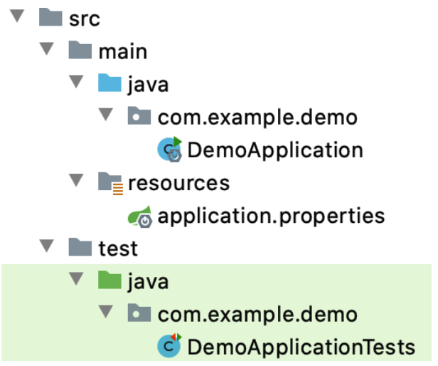

### Chapter 1. Spring Boot in a Nutshell

SpringBoot simplified dependency management, simplified deployment, and autoconfiguration.

1. Dependency Management

Spring Boot have 30 Boot starters availabe. Below shows the Web Starter, Test Starter, and Data JPA Starter

* The Web Starter

When developing the REST servie, we need use libraries like Spring MVC, Tomcat and Jackson for a single application. Spring Boot starters can help to reduce the number of manually added dependencies just by adding one dependency. So instead of manually specifying the dependencies just add one starter as in the following example:

```xml
<dependency>
    <groupId>org.springframework.boot</groupId>
    <artifactId>spring-boot-starter-web</artifactId>
</dependency>
```

Now you can create a REST controller

```java
@RestController
public class GenericEntityController {
    private List<GenericEntity> entityList = new ArrayList<>();

    @RequestMapping("/entity/all")
    public List<GenericEntity> findAll() {
        return entityList;
    }

    @RequestMapping(value = "/entity", method = RequestMethod.POST)
    public GenericEntity addEntity(GenericEntity entity) {
        entityList.add(entity);
        return entity;
    }

    @RequestMapping("/entity/findby/{id}")
    public GenericEntity findById(@PathVariable Long id) {
        return entityList.stream().
                 filter(entity -> entity.getId().equals(id)).
                   findFirst().get();
    }
}
```

The *GenericEntity* is a simple bean with *id* of type *Long* and *value* of type *String*.

In Spring's approach to building RESTful web services, HTTP requests are handled by a controller

* Test Starter

```xml
<dependency>
    <groupId>org.springframework.boot</groupId>
    <artifactId>spring-boot-starter-test</artifactId>
    <scope>test</scope>
</dependency>
```

* Data JPA Starter

```xml
<dependency>
    <groupId>org.springframework.boot</groupId>
    <artifactId>spring-boot-starter-data-jpa</artifactId>
</dependency>
<dependency>
    <groupId>com.h2database</groupId>
    <artifactId>h2</artifactId>
    <scope>runtime</scope>
</dependency>
```

2. Simplied Deployment???
3. Autoconfiguration

### Chapter 2. Choosing Your Tools and Getting Started

Java application developer can use Maven to build tools. When executing ```mvn``` command, a desired task like compiling, removing, packaging, and running an application can be accomplished.

Maven creates and expects a particular project structure by convention. Below shows a Spring Boot application with typical Maven project structure.



The Spring Boot project can be created either by Spring Initializr’s Project Explorer (https://start.spring.io/) or Spring Boot Command Line Interface (CLI) using ```spring init```. However, both method leverage the Initializr and create the identical project.

### Chapter 3. Creating Your First Spring Boot Rest API

```java
@RestController
@RequestMapping("/coffees")
class RestApiDemoController {
	private List<Coffee> coffees = new ArrayList<>();
	public RestApiDemoController() {
		coffees.addAll(List.of(new Coffee("Café Cereza"),new Coffee("Café Ganador"),
				new Coffee("Café Lareño"),new Coffee("Café Três Pontas")));
	}
	@GetMapping
	Iterable<Coffee> getCoffees() {
		return coffees;
	}
	@GetMapping("/{id}")
	Optional<Coffee> getCoffeeById(@PathVariable String id) {
		for (Coffee c: coffees) {
			if (c.getId().equals(id)) {
				return Optional.of(c);
			}
		}
		return Optional.empty();
	}
	@PostMapping
	Coffee postCoffee(@RequestBody Coffee coffee) {
		coffees.add(coffee);
		return coffee;
	}
	@PutMapping("/{id}")
	ResponseEntity<Coffee> putCoffee(@PathVariable String id,@RequestBody Coffee coffee) 	{
		int coffeeIndex = -1;
		for (Coffee c: coffees) {
			if (c.getId().equals(id)) {
				coffeeIndex = coffees.indexOf(c);
				coffees.set(coffeeIndex, coffee);
			}
		}
		return (coffeeIndex == -1) ?
				new ResponseEntity<>(postCoffee(coffee), HttpStatus.CREATED) :
				new ResponseEntity<>(coffee, HttpStatus.OK);
	}
	@DeleteMapping("/{id}")
	void deleteCoffee(@PathVariable String id) {
		coffees.removeIf(c -> c.getId().equals(id));
	}
}
```

```@RestController``` annotation tells Spring that this code descibes an endpoint that should be made available over the web.

```@GetMapping("/hello")``` tells Spring to use our ```hello()``` method to answer requests that get sent to the http://localhost:8080/hello address.

```@RequestParam``` is telling Spring to expect a ```name``` value in the request.

### Chapter 4. Adding Database Access to Your Spring Boot App

#### Respository Layer vs Service Layer

Repository居于业务层和数据层之间，将两者隔离开来，在它的内部封装了数据查询和存储的逻辑。这样设计的好处有两个：

1. 降低层级之间的耦合：更换、升级ORM引擎（Hibernate）并不会影响业务逻辑
2. 提高测试效率：如果在测试时能用Mock数据对象代替实际的数据库操作，运行速度会快很多

Repository layer exposes basic CRUD operations. Instead of writing 

```java
var context = new DatabaseContext();
return CreateObjectQuery<Type>().where(t => t.ID == param).First();
```

to get a single item from database, you use repository interface as

```java
public interface IRepository<T>{
	IQueryable<T> List();
	bool Create(T item);
	bool Delete(int id);
	T Get(int id);
	bool SaveChanges();
}
```

Service layer, on the other hand, exposes business logic, which uses repository.

```java
public interface IUserService
{
    User GetByUserName(string userName);
    string GetUserNameByEmail(string email);
    bool EditBasicUserData(User user);
    User GetUserByID(int id);
    bool DeleteUser(int id);
    IQueryable<User> ListUsers();
    bool ChangePassword(string userName, string newPassword);
    bool SendPasswordReminder(string userName);
    bool RegisterNewUser(RegisterNewUserModel model);
}
```

The process is as follows: **[Controller] calls [Service(s)] who calls [repository(ies)]**

#### Implement the JPA Repository

H2 is JPA-compliant fast database written in Java, so we can connect our application to it in the same manner we would to any other JPA database like Microsoft SQL, MySQL, Oracl, or PostgreSQL.

As mentioned earlier, H2 is a JPA-compliant database, so I'll add JPA annotations to connect the dots. I'll add an ```@Entity``` annotation from ```javax.persistence``` that indicates ```Coffee``` is a persistable entity, and add ```@Id``` annotations (also from ```java.persistence```) to mark it as the database table's ID field.

In order to add JPA and H2 database into the project. Add the following to the *pom*, otherwise  importing ```javax.persistence``` can't be resolved.

```xml
      <dependency>
        <groupId>org.springframework.boot</groupId>
        <artifactId>spring-boot-starter-data-jpa</artifactId>
      </dependency>
      <dependency>
        <groupId>com.h2database</groupId>
        <artifactId>h2</artifactId>
        <scope>runtime</scope>
      </dependency>
```

```java
import javax.persistence.Entity;
import javax.persistence.Id;

@Entity
class Coffee {
	@Id
	private String id;
	private String name;
}
```

With Coffee now defined as a valid JPA entity able to be stored and retrieved, it's time to make the connection to the database.

To enable repository in our app, we define the interface CoffeeRepository by extending Spring Data repository.

```java
import org.springframework.data.repository.CrudRepository;
interface CoffeeRepository extends CrudRepository<Coffee, String> {}
```

We use the CoffeeRepository as follows

```java
@RestController
@RequestMapping("/coffees")
class RestApiDemoController {
	private final CoffeeRepository coffeeRepository;
	public RestApiDemoController(CoffeeRepository coffeeRepository) {
		this.coffeeRepository = coffeeRepository;
		this.coffeeRepository.saveAll(List.of(
				new Coffee("Café Cereza"),
				new Coffee("Café Ganador"),
				new Coffee("Café Lareño"),
				new Coffee("Café Três Pontas")
		));
	}
	@GetMapping
	Iterable<Coffee> getCoffees() {
		return coffeeRepository.findAll();
	}
	@GetMapping("/{id}")
	Optional<Coffee> getCoffeeById(@PathVariable String id) {
		return coffeeRepository.findById(id);
	}
	@PostMapping Coffee postCoffee(@RequestBody Coffee coffee) {
		return coffeeRepository.save(coffee);
	}
	@PutMapping("/{id}")
	ResponseEntity<Coffee> putCoffee(@PathVariable String id, @RequestBody Coffee coffee) {
		return (!coffeeRepository.existsById(id))
				? new ResponseEntity<>(coffeeRepository.save(coffee),
				HttpStatus.CREATED)
				: new ResponseEntity<>(coffeeRepository.save(coffee), HttpStatus.OK);
	}
	@DeleteMapping("/{id}")
	void deleteCoffee(@PathVariable String id) {
		coffeeRepository.deleteById(id);
	}
}
```

#### What is JPA?

JPA stands for Java Persistence API.  It is a specification that define which object should be persisted, and how those objects should be persisted in your Java application.

The ORM layer converts Java classes and objects so that they can be stored and managed in a relational database.

The musician class below is used to hold data. It can contain primitive data such as the *name* field. It can also hold relations to other classes such as `mainInstrument` and `performances`.

```java
public class Musician {
  private Long id;
  private String name;
  private Instrument mainInstrument;
  private ArrayList performances = new ArrayList<Performance>();

  public Musician( Long id, String name){ /* constructor setters... */ }

  public void setName(String name){
    this.name = name;
  }
  public String getName(){
    return this.name;
  }
  public void setMainInstrument(Instrument instr){
    this.instrument = instr;
  }
  public Instrument getMainInstrument(){
    return this.instrument;
  }
  // ...Other getters and setters...
}
```

`Musician`'s *reason for being* is to contain data. This type of class is sometimes known as a DTO, or *data transfer object*. DTOs are a common feature of software development. While they hold many kinds of data, they do not contain any business logic. 

#### Data persistence comparison using pure JDBC and JPA

**JDBC**

```java
	Musician georgeHarrison = new Musician(0, "George Harrison");

    String myDriver = "org.gjt.mm.mysql.Driver";
    String myUrl = "jdbc:mysql://localhost/test";
    Class.forName(myDriver);
    Connection conn = DriverManager.getConnection(myUrl, "root", "");

    String query = " insert into users (id, name) values (?, ?)";
    PreparedStatement preparedStmt = conn.prepareStatement(query);
    preparedStmt.setInt    (1, 0);
    preparedStmt.setString (2, "George Harrison");
    preparedStmt.setString (2, "Rubble");

    preparedStmt.execute();
    conn.close();
```

**JPA**

```java
    Musician georgeHarrison = new Musician(0, "George Harrison");
    musicianManager.save(georgeHarrison);
```

The annotations of JPA tells which objects should be persisted and how they should be persisted. For example:

```java
@Entity
@Table(name="musician")
public class Musician {
   @Id
   private Long id;
  // ..class body
}
```

```@Entity```: informs JPA that this class and its object should be persisted

```@Table```: specify the table where the Musician class should be stored

```@id```: specify id field as Musician's primary key.  

To enable our application to interact with the H2 database, I'll add the following two dependencies to the <dependencies> section of our project's *pom.xml*

```
<dependency> 
    <groupId>org.springframework.boot</groupId> 
    <artifactId>spring-boot-starter-data-jpa</artifactId> 
</dependency> 
<dependency> 
    <groupId>com.h2database</groupId>
    <artifactId>h2</artifactId> 
    <scope>runtime</scope> 
</dependency>
```

#### What is JPA Entity?

An entity represents a table stored in a database. Every instance of an entity represents a row in the table. Let's create a Student persistent class that is mapped to a **student** database table.

```java
import javax.persistence.Column;
import javax.persistence.Entity;
import javax.persistence.GeneratedValue;
import javax.persistence.GenerationType;
import javax.persistence.Id;
import javax.persistence.Table;

@Entity
@Table(name = "student")
public class Student {
    @Id
    @GeneratedValue(strategy = GenerationType.IDENTITY)
    @Column(name = "id")
    private int id;
    @Column(name = "first_name")
    private String firstName;
    @Column(name = "last_name")
    private String lastName;
    @Column(name = "email")
    private String email;
    
    public Student() {}
    public Student(String firstName, String lastName, String email) {...}
    public int getId() {...}
    public void setId(int id) {...}
    public String getFirstName() {...}
    public void setFirstName(String firstName) {...}
    public String getLastName() {...}
    public void setLastName(String lastName) {...}
    public String getEmail() {...}
    public void setEmail(String email) {...}
    @Override
    public String toString() {...}
}
```

Below is another example

```java
import org.hibernate.annotations.Type;
 
import javax.persistence.Column;
import javax.persistence.Entity;
import javax.persistence.GeneratedValue;
import javax.persistence.GenerationType;
import javax.persistence.Id;
import javax.persistence.PrePersist;
import javax.persistence.Table;
import javax.persistence.Version;
import java.time.ZonedDateTime;
 
@Entity
@Table(name = "todos")
final class Todo {
    @Id
    @GeneratedValue(strategy = GenerationType.AUTO)
    private Long id;
  
    @Column(name = "creation_time", nullable = false)
    @Type(type = "org.jadira.usertype.dateandtime.threeten.PersistentZonedDateTime")
    private ZonedDateTime creationTime;
 
    @Column(name = "description", length = 500)
    private String description;
 
    @Column(name = "modification_time")
    @Type(type = "org.jadira.usertype.dateandtime.threeten.PersistentZonedDateTime")
    private ZonedDateTime modificationTime;
 
    @Column(name = "title", nullable = false, length = 100)
    private String title;
 
    @Version
    private long version;
     
    //The constructor, builder, and other methods are omitted
}
```

After creating the entity class, you are able to create the Spring Data JPA repository.  We can create the repository that provides CRUD operations for *Todo* objects by using one of the following methods:

1. Create an interface that extends the [*CrudRepository*](http://docs.spring.io/spring-data/data-commons/docs/current/api/org/springframework/data/repository/CrudRepository.html) interface.
2. Create an interface that extends the [*Repository*](http://docs.spring.io/spring-data/data-commons/docs/current/api/org/springframework/data/repository/Repository.html) interface and add the required methods to the created interface.

If we create our repository by extending the *CrudRepository* interface, we have to provide two type parameters:

1. The type of the entity that is managed by our repository.
2. The type of the entity’s id field.

```java
import org.springframework.data.repository.CrudRepository;
 
interface TodoRepository extends CrudRepository<Todo, Long> {
 }
```

The `CrudRepository` has basic create, read, update, delete operation methods:

- `<S extends T> S save(S entity); `Saves a given record to the DB
- `<S extends T> Iterable<S> saveAll(Iterable<S> entities);` Saves multiple records to the DB.
- `Optional<T> findById(ID id);` Finds a record that matches the Id
- `boolean existsById(ID id);` Checks if a record exists with the provided Id
- `Iterable<T> findAll();` Fetches all records from DB
- `Iterable<T> findAllById(Iterable<ID> ids);` fetches all records that match the provided Ids
- `long count();` returns the number of records in the DB.
- `void deleteById(ID id);` Deletes the entity with the given id.
- `void delete(T entity);` Deletes a given entity.
- `void deleteAll(Iterable<? extends T> entities);` Deletes all the records provided.
- `void deleteAll();` deletes all records from the DB

### Chapter 5. Configuring and Inspecting Your Spring Boot App

**@ConfigurationProperties**

在编写项目代码时，我们要求更灵活的配置，更好的模块化整合。在 Spring Boot 项目中，为满足以上要求，我们将大量的参数配置在 application.properties 或 application.yml 文件中，通过 ```@ConfigurationProperties``` 注解，我们可以方便的获取这些参数值.

First adding the dependencies

```xml
		<dependency>
			<groupId>org.springframework.boot</groupId>
			<artifactId>spring-boot-configuration-processor</artifactId>
			<version>2.4.5</version>
		</dependency>
```

In *application.properties* adding the following configuration properties.

```
greeting.name = Dakota
greeting.coffee=${greeting.name} is drinking Cafe Cereza
```

Create a Greeting class with annotation ```@ConfigurationProperties``` to hold and locate the configuration properties.

```javascript
@ConfigurationProperties(prefix = "greeting")
class Greeting {
	private String name;
	private String coffee;

	public String getName() {
		return name;
	}
	public void setName(String name) {
		this.name = name;
	}
	public String getCoffee() {
		return coffee;
	}
	public void setCoffee(String coffee) {
		this.coffee = coffee;
	}
}
```

### Chapter 6. Really Digging into Data

The first step is to define any *domain* classes that will be used to handle applicable data. A domain classs encapsulates a primary domain entity that has relevance and significance independently of other data. It can stand alone and make sense as a unit.

To create a domain class you can create a class with member variables, applicable constructors, accessors/mutators, and *equals()/hashCode()/toString()* methods by employing *Lombok* with Java.

```java
import com.fasterxml.jackson.annotation.JsonProperty;
```

```@JsonProperty(name)```, tells Jackson ObjectMapper to map the JSON property name to the annotated Java field's name.

```java
//example of json that is submitted 
"Car":{
  "Type":"Ferrari",
}

//where it gets mapped 
public static class Car {
  @JsonProperty("Type")
  public String type;
 }
```

```java
import lombok.AllArgsConstructor;
```

`@AllArgsConstructor` annotation automatically generates a constructor with a *parameter* for **each** field in your class.

**Redis**

Spring Data provides different connection factories to get Redis connections. The example of connection factories are *JedisConnectionFactory*, *LettuceConnectionFactory* 

Spring Data provides *RedisTemplate* to perform Redis operations. It performs automatic serialization and deserialization between the given objects and binary data stored in Redis. It has methods such as `opsForList()`, `opsForSet()`, `opsForHash()` etc that return `ListOperations`, `SetOperations`, `HashOperations` respectively.

The RedisTemplate class extends the RedisAccessor class and implements the RedisOperations interface. `public interface RedisOperations<k,v>` is an interface and implemented by `public class RedisTemplate<k,v>`

```java
public class RedisTemplate<k,v> extends RedisAccessor implements RedisOperations<k,v>
```

RedisAccessor is the base class for RedisTemplate and not intended to be used directly


Reference:

1. https://www.petrikainulainen.net/programming/spring-framework/spring-data-jpa-tutorial-part-two-crud/
2. https://java2blog.com/spring-boot-crudrepository/
3. https://www.baeldung.com/spring-boot-starters
4. https://www.concretepage.com/spring-4/spring-data-redis-example (redis for spring)
5. https://www.cnblogs.com/taobean/p/12364256.html (beans)
6. https://codedelay.com/spring-bean-what-is-spring-bean-with-examples/ (beans)
7. https://docs.spring.io/spring-javaconfig/docs/1.0.0.M4/reference/html/ch02s02.html (beans)
8. https://zetcode.com/springboot/bean/ (beans)
9. https://www.awaimai.com/2596.html (beans)